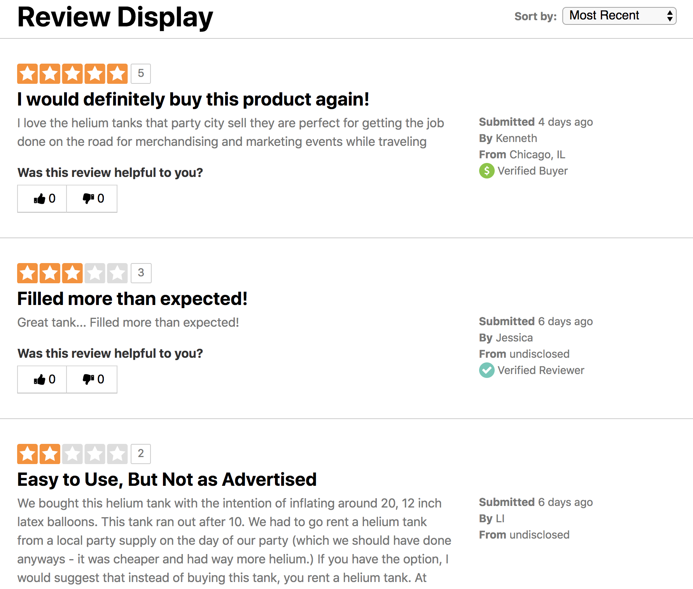

# Review Display

The goal of this excercise is to build a simple version of a review display widget commonly found on retailer product detail pages.

The widget will primarily fetch and render a list of reviews. It will allow users to sort reviews, and vote for helpful or unhelpful reviews. The widget must be implemented using [React](https://reactjs.org/), but you are free to use any other dependencies.

The starter project was bootstrapped with [create-react-app](https://github.com/facebook/create-react-app), usage details can be found [here](CREATE_REACT_APP_README.md). The starter project includes a webservice that returns review data, as well as some helpful components.

## Requirements

* Node JS >= 4 https://nodejs.org/en/
* Yarn >= 1 https://yarnpkg.com/en/

## Usage

Run `yarn` inside the project to install all dependencies.

```
yarn
```

Additional dependencies can be added by running:

```
yarn add ${pkg-name}
```

### Available Commands

| Command   | Description                                                                                                |
| --------- | ---------------------------------------------------------------------------------------------------------- |
| `start`   | Concurrently starts dev server and review service. **Your solution will be evaluated using this command.** |
| `app`     | Starts webpack dev server on port 3000                                                                     |
| `service` | Starts review service on port 5000                                                                         |

## Submitting your solution

* Change the `name` field in the `package.json` to `${first-name}-${lastname}`. For example, if your name is Jane Doe your package.json will look like following:

```js
{
  name: "jane-doe",
  version: "1.0.0"
}
```

* Run `yarn pack` inside the package, the will generate a zipped tarball. This tarball is the file you will be submitting. In the case of the example above, the file generated will be `jane-doe-v1.0.0.tgz`.

To evaluate your solution we will unzip the tarball and then run `yarn start` inside the folder.

## Notes

* While we've given you a week to complete this project, we estimate that you will not need more than 8 hours of work to achieve all of the requirements.
* Perfect is the enemy of good. Don't try too hard to impress us, you can always leave notes detailing improvements/extensions.
* We appreciate your time commitment and we promise to provide feedback on your submission.

## Required functionality

### Review Listing

Use the data returned by the service to render a list of reviews similar to the attached mockup. Each review container should have a `data-id` attribute set to the `review_id` property.

<details>
<summary>View Mockup</summary>

</details>

### Sorting

Support client side sorting by

* Most Recent (default)
* Most Helpful (based on `helpful_score`)
* Lowest Rated
* Highest Rated
* Oldest

### Reviewer Badges

Badges relay authenticity information about the review author. For example a review by verified buyer will likely be given stronger consideration than a review with no badging. Only render one badge for a review, the badge to be displayed should be determined using the following order:

* Staff Reviewer
* Verified Buyer
* Verified Reviewer

Badges icons can be found in [src/icons/badges](src/icons/badges.js).

### Helpful voting

Users can indicate if a review was helpful or not. Voting should be captured and confirmed on the client side. A user may only cast one vote per review. There is no service endpoint to capture votes. Votes do not need to persist through page reloads.

<details>
<summary>View Mockup</summary>

</video>
</details>
